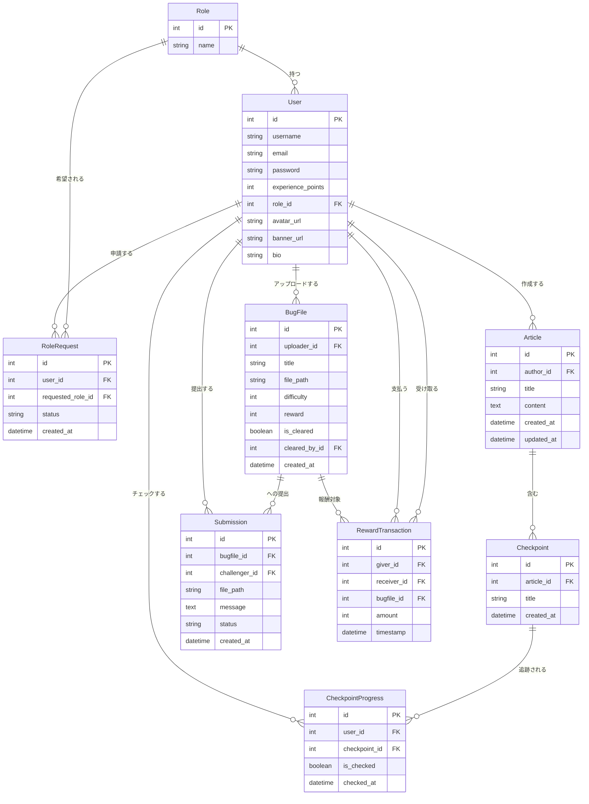

```mermaid
erDiagram
    %% --- ユーザー・ロール関連 ---
    User {
        int id PK
        string username
        string email
        string password
        int experience_points
        int role_id FK
        string avatar_url      
        %% プロフィール画像
        string banner_url      
        %% バナー画像
        string bio             
        %% 一言コメント
    }

    Role {
        int id PK
        string name
        %% "student" / "teacher" / "staff"
    }

    RoleRequest {
        int id PK
        int user_id FK
        int requested_role_id FK
        string status
        %% "pending" / "approved" / "rejected"
        datetime created_at
    }

    %% --- 記事・チェックポイント関連 ---
    Article {
        int id PK
        int author_id FK
        string title
        text content
        datetime created_at
        datetime updated_at
    }

    Checkpoint {
        int id PK
        int article_id FK
        string title
        datetime created_at
    }

    CheckpointProgress {
        int id PK
        int user_id FK
        int checkpoint_id FK
        boolean is_checked
        datetime checked_at
    }

    %% --- バグバウンティ関連 ---
    BugFile {
        int id PK
        int uploader_id FK
        string title
        string file_path
        %% 実際のファイルは Django の FileField で管理
        int difficulty
        int reward
        boolean is_cleared
        int cleared_by_id FK 
        datetime created_at
    }

    Submission {
        int id PK
        int bugfile_id FK
        int challenger_id FK
        string file_path
        %% 提出ファイルも Django の FileField で扱う
        text message
        %% status は "pending" / "approved" / "rejected"
        string status
        datetime created_at
    }

    RewardTransaction {
        int id PK
        int giver_id FK
        int receiver_id FK
        int bugfile_id FK
        int amount
        datetime timestamp
    }

    %% --- リレーションシップ（日本語ラベル） ---
    Role ||--o{ User : "持つ"
    User ||--o{ RoleRequest : "申請する"
    Role ||--o{ RoleRequest : "希望される"

    User ||--o{ Article : "作成する"
    Article ||--o{ Checkpoint : "含む"
    User ||--o{ CheckpointProgress : "チェックする"
    Checkpoint ||--o{ CheckpointProgress : "追跡される"

    User ||--o{ BugFile : "アップロードする"
    User ||--o{ Submission : "提出する"
    BugFile ||--o{ Submission : "への提出"

    BugFile ||--o{ RewardTransaction : "報酬対象"
    User ||--o{ RewardTransaction : "支払う"
    User ||--o{ RewardTransaction : "受け取る"
```
